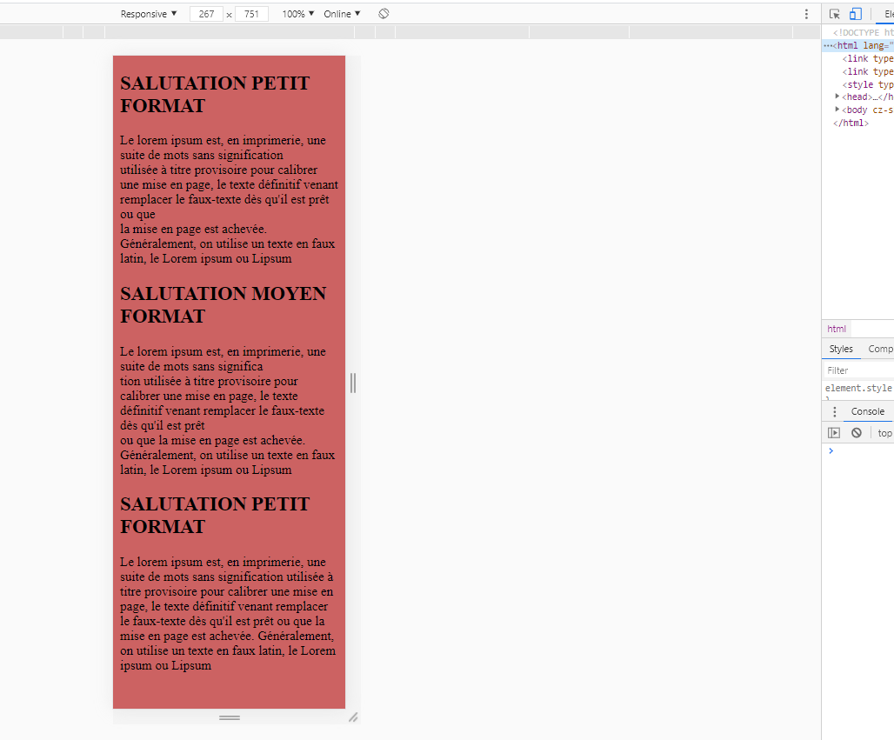

content of the link#### NAME: [Bertchi](https://github.com/Bruxellesflorian)
#### FIRST NAME: [Florian](https://github.com/Bruxellesflorian)
#### DATE: 28.10.2020
---
# Responsive 
## Introduction: 
This is a training for the responsive rendering of a web page.

### Link to the instructions:
> [Link to the instructions](https://github.com/becodeorg/bxl-hopper-1-25/tree/master/The%20Field/3.HTML%2BCSS/2.responsive)
### link content
> [Link](https://bruxellesflorian.github.io/Responsive/)
### Content:

